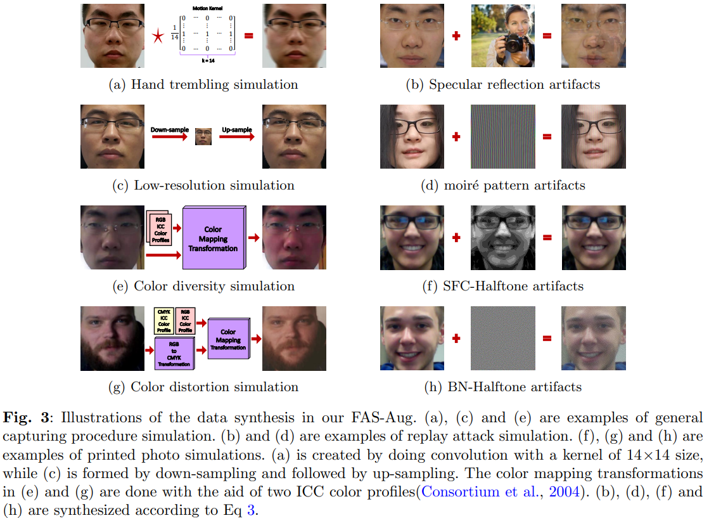

# FAS-Aug
The code repo for the paper ["Towards Data-Centric Face Anti-Spoofing: Improving Cross-domain Generalization via Physics-based Data Synthesis"](https://arxiv.org/pdf/2409.03501v1). 


## Setup
Code downloading
```bash
git clone https://github.com/CeceliaSoh/FAS-Aug.git
```

Build Environment
```bash
cd FAS-AUG
conda create --name fas-aug python
conda activate fas-aug
pip install -r requirements.txt
```

## Data Preparation
1. Please download the datasets you need. Due to the license, I cannot redistribute the datasets. You have to download the datasets by submitting your requests. The links for downloading the datasets can be found in  https://github.com/RizhaoCai/Awesome-FAS.
2. Configure directories  
2.1 Go to [data/extract_frames_mtcnn.py](data/extract_frames_mtcnn.py)  
2.2 Configure the MTCCN path (check line 14 of [data/extract_frames_mtcnn.py](data/extract_frames_mtcnn.py))  
2.3 Check lines 22 and 23. Configure `ROOT_DIR` and `SAVE_DIR`  
3. Run scripts to extract data frames  
    ```shell
    cd data
    # Change the DATASET_NAME you need; Check the keys of the dict 'DATASET_DIR' in data/extract_frames_mtcnn.py
    DATASET_NAME='CASIA-FASD'; python extract_frames_mtcnn.py ${DATASET_NAME}
    cd ..
    ```
Please configure `_C.DATA.ROOT_DIR` in [config/defaults.py](config/defaults.py), which is the root directory where you save the preprocessed data.

## Training
```bash
# Train models for the I&C&M to O protocol
python train.py --trainer vit_convpass DATA.EXTRA_DOMAIN 3 DATA.TRAIN_LIST "['data/data_list/CASIA-ALL.csv', 'data/data_list/MSU-MFSD-ALL.csv', 'data/data_list/REPLAY-ALL.csv']" DATA.TEST "data/data_list/OULU-NPU-ALL.csv" TRAIN.AUG.BAG 'FAS_Augmentations'
```
Some important hyperparameters:
* `DATA.TRAIN_LIST`: A list of training domain datasets, where each domain is stored in a separate CSV file. More datasets' CSV file can be found in [data/data_list](data/data_list).
* `DATA.TEST`: The test domain datasets.
* `TRAIN.AUG.BAG`: Defines the augmentation strategy applied to the training data. When set to `FAS_Augmentations`, it applies the FAS augmentation technique proposed in this work.
* `DATA.EXTRA_DOMAIN`: The number of additional domains for applying the FAS augmentation. The default value is 3.

More parameters can be found in [config/defaults.py](config/defaults.py)  
This file provide many basic configs for data, network, and training. Some model-specific/custom configs are in each sub-folders of [models] (e.g. [models/vit_convpass/custom_config.py](models/vit_convpass/custom_config.py)). Custom configs will be merged with the deafult config.

## Citation
If you use this repo, please kindly cite the below papers
```
@article{cai2024towards,
  title={Towards Data-Centric Face Anti-Spoofing: Improving Cross-domain Generalization via Physics-based Data Synthesis},
  author={Cai, Rizhao and Soh, Cecelia and Yu, Zitong and Li, Haoliang and Yang, Wenhan and Kot, Alex},
  journal={arXiv preprint arXiv:2409.03501},
  year={2024}
}
```